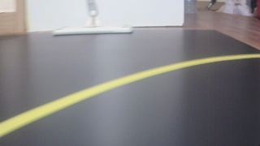
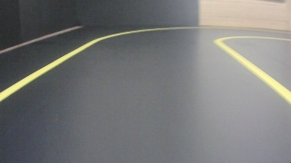
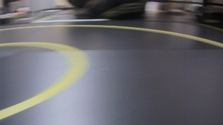

# Read Simulator

This project is for creating a dataset for training autonomous vehicles. Although there are many datasets on the Internet, most of them are not controllable. Therefore, I started this project to create a fully controllable dataset freely.

You can get the simulation images (look like real world) by selecting proper material and light. Then, just by removing lights and changing all materials to `MeshBasicMaterial` with different color by object, you can get perfect labels for simulation image.

It does not requires any dependency except a modern web browser such as Chrome. If you are currently using chrome, you can visit [my simulation](https://unknownpgr.github.io/road-simulator/index.html) and see how it works!

Since this project was created using `WebGL`+`THREE.js`, you can apply almost any effect. Below are some examples.

- Image resize
- Add noise on image
- Apply [blur](https://stackoverflow.com/questions/15354117/three-js-blur-the-frame-buffer) (including [motion blur](https://codepen.io/tjezidzic/pen/LMppKp)) effect
- More realistic rendering with [ray tracing(!!!)](http://madebyevan.com/webgl-path-tracing/)
- [Physics simulation](https://chandlerprall.github.io/Physijs/)
- Add noise on lane (so that the lanes are winding)
- Add some other vehicles

...And everything you can imagine.

# Comparation

In this section, You will probably realize that the simulated image is a bit yellow. This makes it difficult to distinguish between the background and the lane. I intended it so that the AI trained with this dataset will work well in environments where lanes and backgrounds are confusing.

## Simulation Result

Below are some result from the simulation.

## Real-World Result

Below are real some images from camera (on toy car).

